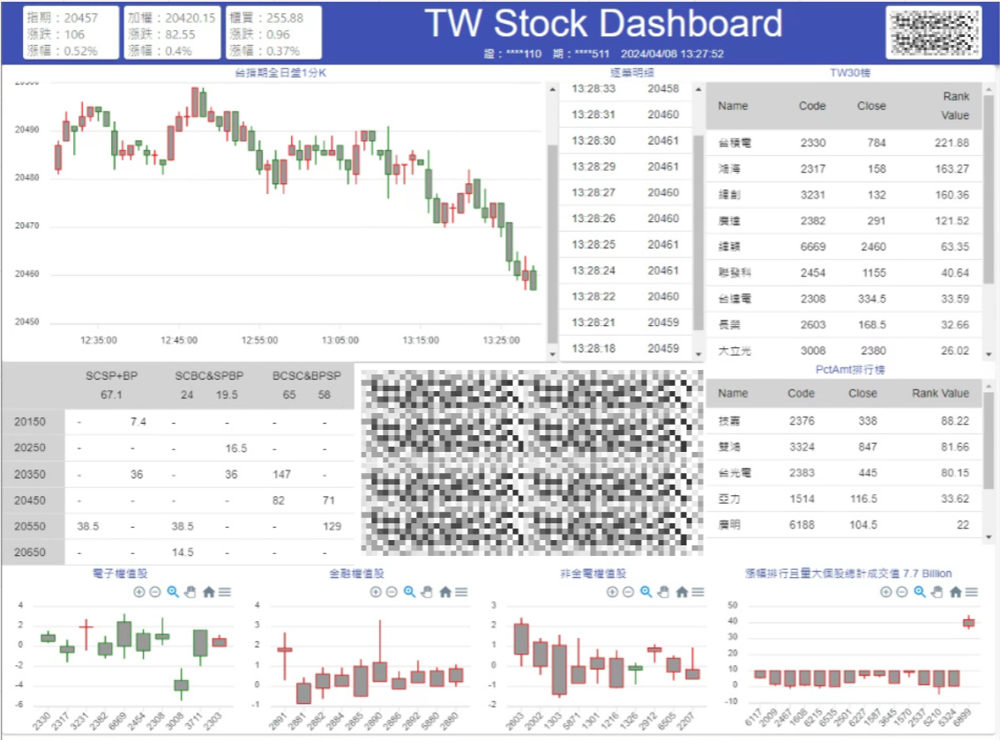

The dashboard features a highly customized layout presenting real-time data for diverse financial instruments (stocks, futures, options). Advanced analytics enable traders to swiftly react to market fluctuations, offering a competitive edge in timing trades and seizing lucrative  opportunities.

